# README

### AndrewDevitt_T2A2
## Marketplace Web Application - Bored-Games

## Site Link
https://bored-games-v2.herokuapp.com/

## Github Repository
https://github.com/AnderDevitt/bored-gamesV2

## THE PROBLEM WITH USED GAMES 

Hobbyists and collectors of board games face a few problems that this application tries to solve. 

1. As a seller, where should I advertise my game? There is no central place for selling or giving away old games. Each current option has it's pros and cons, but I'll list a few cons:

    * Op-shops expect you to give them the game for free
    * eBay is flooded with games and auctions (buyers can get lost or put off)
    * Amazon is not suited to small sellers or one-offs
    * Gumtree can be exhausting to scroll through and often shows products unrelated to your search.
    * Some game owners give up and resort to throwing old treasured games in the garbage

2. As a buyer, how can I find a game without searching on every site? It can take a long time to hunt down old games online.
 In addition, gamers are more likely to sell games at reasonable prices as they will also be hoping to find new games for themselves from the marketplace. Other 
 online stores are focused on selling products to make money.

3. For both buyers and sellers, postage and shipping costs for sites like eBay can be arbitrary and cost as much or more than a game.
This site aims to encourage local dealings and would in its end state enable local pick-up and delivery by the buyers and sellers.

We need to solve this problem because many old and out of print games are lost either to the rubbish 
heap, when gamers give up trying to sell them on due to the hassle. Or they are hoarded by people hoping to
make a fortune at someone else's expense.

## BORED-GAMES DESCRIPTION
Bored-Games is a two-sided marketplace application designed to enable users to buy and sell board games within their local gaming community. The key aim is to create a one-stop place to search for and sell used games. 
As gamers, we want to ensure that these old games go to people who will value them, and to see them remain available for the future.

## PURPOSE
To ensure that gamers can find and sell games in a local/regional environment. To keep games in circulation even after the are no longer in print, and to avoid high shipping costs.

The site will:
* Allow anyone to view and search for games
* Allow any logged in user to buy or sell games 
* Allow users to edit their personal data and game data (for games they are selling)
* Allow payments to be made by Stripe

## FUNCTIONALITY & FEATURES
### Site navigation
The site includes a navbar at the top of the page. All areas of the site are reachable from here.
However, what the user sees and has access to will depend on whether they are signed in and who they are. 
A guest will see basic game search options and the options to sign in or sign up. 
A signed in user will see their name, hovering over this will give more personal options for them and a logout link.
This navbar becomes a hamburger menu on smaller screens.

Pages have links and buttons to perform actions and navigate to new pages and back.

### External links
The site links to Stripe.com for payments and a receipt url. When a user chooses to buy a game, payment is made via the Stripe gem and credit card field, which will pop-up on the screen.
Users can later check the receipts for purchases in their "Purchase history" page. Clicking the "See receipt" button will open an external page with the relevant receipt.

### Image uploading
The site does use two static images stored within the application files, but all user images are uploaded to Amazon Web Services (AWS) S3 service.
When a user creates a listing for a game they wish to sell, an attached image (.jpg, .jpeg, .png formats accepted) is uploaded and stored with Amazon.
The application will retrieve the images from the S3 server when rendering relevant page views in the application.

### CRUD (Create, Read, Update, Delete)
The application has been designed to allow authorised users to persofm the relevant CRUD functions on data.
Guests may read (see) games only. Signed in users may additionally create new games, edit, and delete their games but not others.
Signed in users may also review and edit the user data (login and address details) which they entered when signing up. However they cannot delete this data. 
While being able to delete such user data is ideal, it would corrupt other data such as purchase records, which need the details of the seller and buyer of a game to be accurate.
Administrators can do anything that a signed in user can do. Additionally they can perform some CRUD actions on games created by users. 

### Alerts and Notices
The application will display alert and notice massages at the top of the screen to inform the user about successful actions and errors. 

## SITEMAP
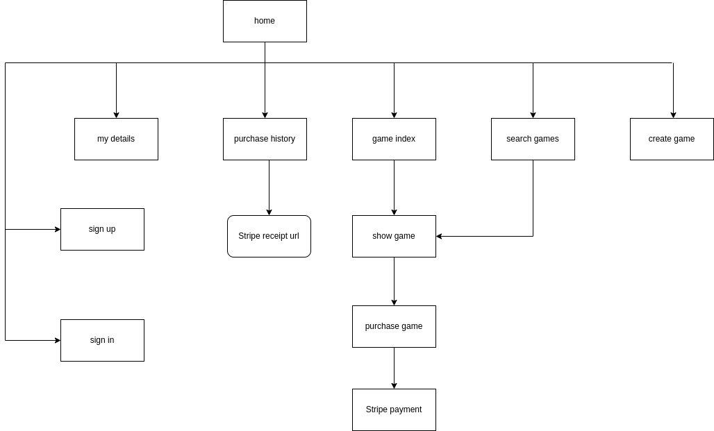

## SCREENSHOTS
### Navbar
Guest and Logged-in user navbars

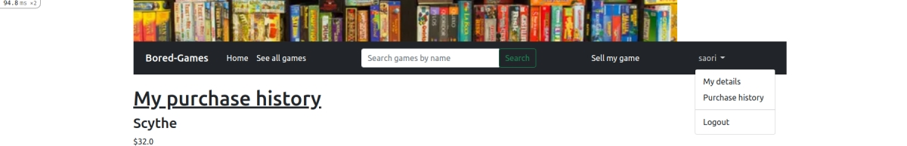
### Pages
Home page
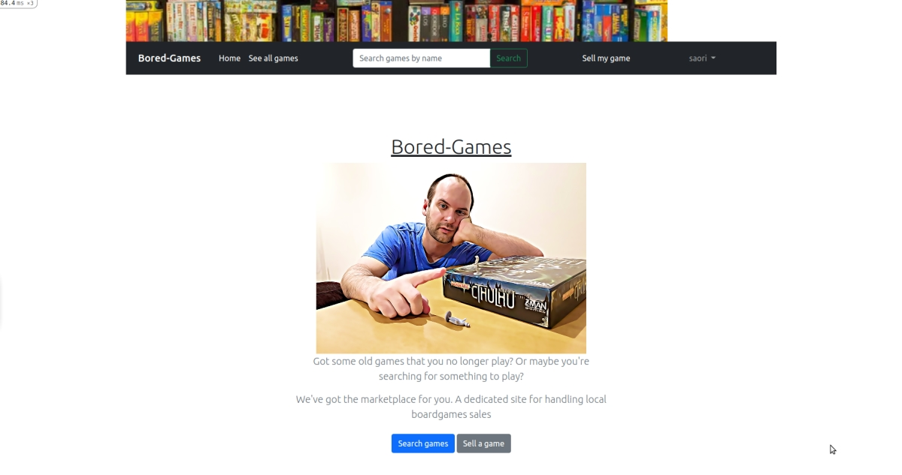
Games index page
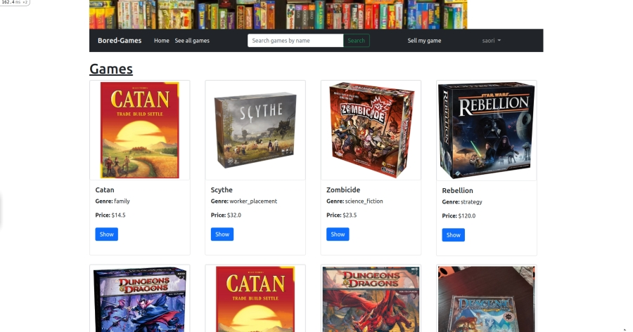
Game show page
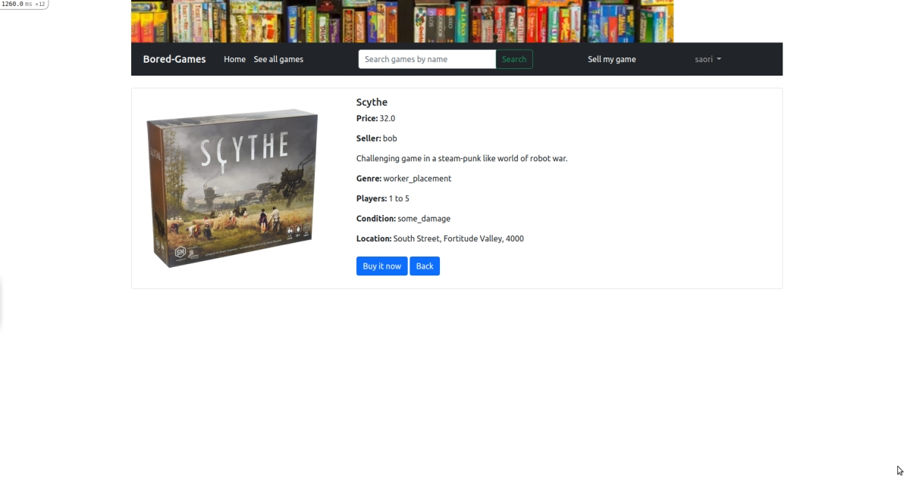
New/Sell game page
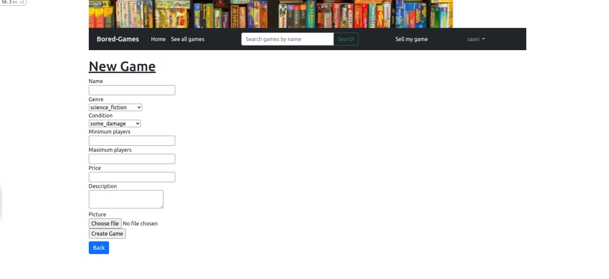
Buy a game page
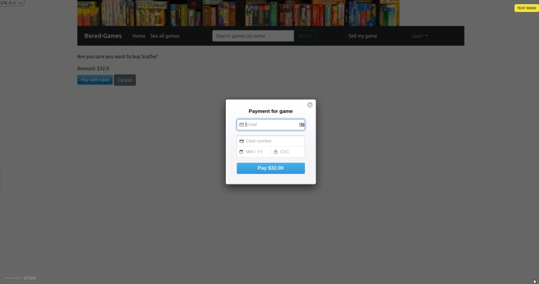
Purchase complete page
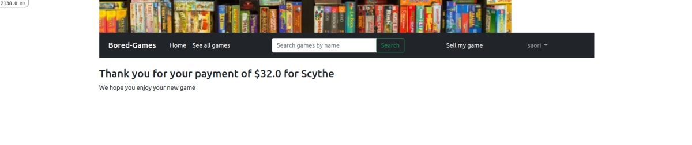
Search page
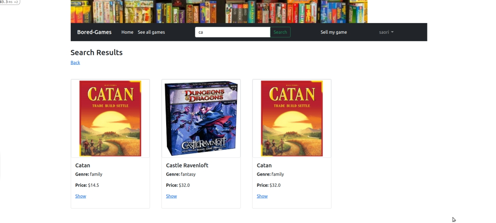
User details page
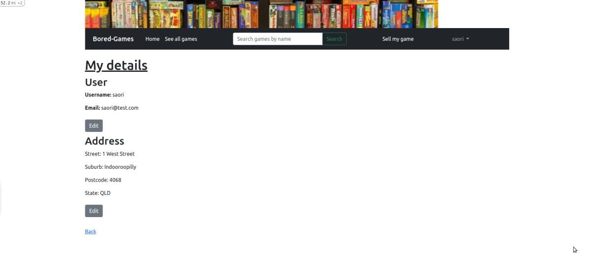
Purchase history page
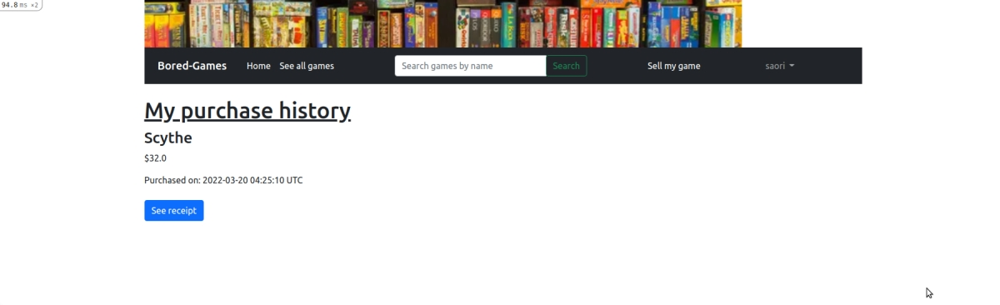

## TARGET AUDIENCE
The target audience for this site are local gamers wishing to buy and sell used games in an easier and more secure and convenient way.
While the site currently has less features than would be required for real-life use, a few extra features would allow for this goal.

* The site currently displays the seller's general address. In future, this would be linked to a map so users can see how close they are.
* Buyers should in future be able to message the sellers and arrange pick up, drop off, or local post. This would then be confirmed at purchase.
* Buyer and seller feedback and ratings would also be included to help with honesty.

## TECH STACK
The tech stack I worked with to produce this application.

### Code
* HTML
* Bootstrap & SCSS
* Ruby
* Ruby on Rails

### Database
*Postgresql

### Control
* Github
* Github
* Trello

### Deployment
* Heroku

## USER STORIES

The user personas are: guest, user, seller, admin.

### Guest
* As a guest I can see the list page for all games
* As a guest I can search for games
* As a guest I can view details for a game
* As a guest I can sign up

### User
* As a user I can do all the same things as a guest
* As a user I can log in
* As a user I can log out
* As a user I can buy a game
* As a user I can see my purchase history
* As a user I can see a copy of my receipt
* As a user I can see and edit my details
* As a user I can create a game listing and become a seller

### Seller
* As a seller I can do the same things as a user
* As a seller I can edit my game listings
* As a seller I can delete my game listings

### Admin
* As an admin I can do all the same things as a user
* As an admin I can edit and delete all game listings

## WIREFRAMES

I have included the wireframes as a pdf in the docs folder.

[Wireframes_pdf_file](./docs/AndrewDevitt_T2A2_Marketplace_wireframes.pdf)

## ERD
The ERD has been adjusted as the app has gone through development. For the original version, please refer to the slide deck used in my presentation if you wish to see it.

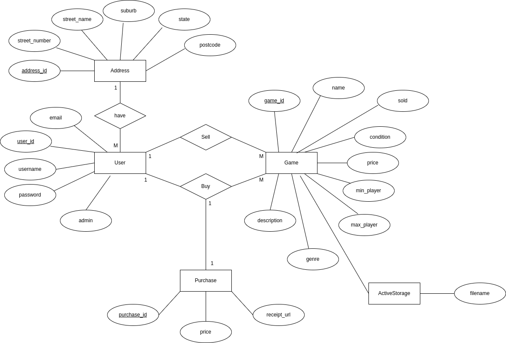

## HIGH-LEVEL COMPONENTS OF THE APP
The application uses Rails Model-View-Controller (MVC) components to access and manipulate the data for the store. 

The models created for this application are Users, Addresses, Games, Purchases, and ActiveStorage. The Rails model files describe the relationships between the tables in the PostgreSQL database. Which classes belong to others for example. In this app, Addresses and Games both belong to Users, and we cannot have either without first having a user instance to associate with them. The models will also create one-to-one and one-to-many relationships between tables. A user can create many different game instances in the app but each game instance can only be created by a single user.

Rails also allosw for class inheritance. The ApplicationRecord class (model) inherits all of the attributes of the ActiveRecord base class. This allows us to use a lot of built in methods and functions anywhere in the program without having to code it all ourselves. In this application I didn't write classes with subclasses, but By dividing games into sub-categories and putting only the common shared attributes in a game class, I could have used inheritance. Similarly the ApplicationController inherits from a base class, and our other classes in the app benefit from this.

The controllers in the rails application take the user requests (HTTP methods) and pass these commands on to the database. Conveniently this means that as coders, we are able to write the requests and instructions in Ruby and the controllers will send SLQ queries to the PostgreSQL database. 

View files are in the format of name.html.erb. These .html.erb files use HTML code to format the pages for the browser, but also allow Rails to run Ruby code within them. Each view file is a page (or part of a page) which will display the site and database data on the user's screen.

We can also use partials (partial views). These are convenient for parts of the code which we wish to render across multiple views. The navigation bar in this app is a partial. This one piece of code is reused on every page, but only needs to be written once in the partial file. It is also only called once in this case in the application.html.erb file. All other pages are rendered into this framework file with the <% yield %> command.

Rails Models, Views and Controllers allow for a more dynamic application which will allow the user to query the database and display the results without having to enter complicated SQL queries themselves.

## THIRD PARTY SERVICES
The application handles credit card payments for games via Stripe.com's payment system. The system is convenient and handles credit card entry errors. It also removes the need for the application to handle or store such sensitive user financial data within its database. Customers can have confidence in their credit card safety.

Stripe also provides access to the receipts for payments made using its service. These can be emailed to customers, or in this case accessed through the user's purchase history in the application.

Amazon Web Services S3 is used to host the images uploaded by the users when they create games. As an industry popular service, this will provide reliable cloud storage. 

Heroku is used to deploy the application and database .As it was first created to host Ruby on Rails applications it is an excelent choice for deployment. 

## PROJECT MODELS (Active record associations)

### User
The User model was created with Devise to handle authentication.

  * A User has one Address. The Address is dependant on the User and will be destroyed with the User instance. A user can only have one address.
  * A User has many Games. A User can create as many Games to sell as they wish.
  * A User accepts the nested attributes for the related Address. 
  * The User is created by Devise and it is authenticatable, registerable, recoverable rememberable, validatable
  * The User is a super class for Address and will build the Address (fill in the address table) as part of the new User process.
  * A User has many Purchases. Users can buy as many games as they wish.

### Address
The Address model is dependant on the User model.

* An Address belongs to a User. 
This is a one-to-one relationship.
  
### Game
Creating a Game instance requires a User to do so. It can be related to an image stored in S3, and be Purchased by a different User.

* A Game belongs to a User. A Game cannot be created without a User to create it.
* A Game has many Users. A game is created by one User and purchased by another.
* A Game has one Purchase. It can only be bought once.
* A Game has one attached Picture. Each Game will have one picture attached which is stored in Amazon S3. In the future this would ideally be changed to a has_many relationship to allow for more photos.

### Purchase
Purchases require both a User and a Game. We cannot have a Purchase unless we have both instances.

* A Purchase belongs to a User.
* A Purchase belongs to a Game.

## DATABASE RELATIONS

### User
The User table has a primary key (PK) user_id. 

### Address
The Address table has a PK Address_id, and a foreign key (FK) user_id to relate it to the User table. The Address instance is created after the User instance.

### Game
Game has a PK Game_id, and a FK User_id. This links the instance with a particular user who creates a game.

### Purchase
The Purchase table has a PK Purchase_id. It has two foreign keys, game_id and user_id. The keys link a specific game with a specific user who buys that game. The game is then related to this user through the Purchase table (relationship). Note that this user is not the same as the one whose user_id is stored in the Game table for that instance. This relationship via the Purchase table allows a Game to be related to two distinct users.

## DATABASE SCHEMA DESIGN
For the most part, the schema design matches my ERD. My original ERD did not include the Purchase table attributes, nor any mention of ActiveStorage. They were added before coding those steps.

It also originally had some diffeent attributes in the User and Game tables. User had an attribute Seller, which was unnecessary in practice. Game now includes the attribute Sold, which allows the application to notify that a game is unavailable and stop others from making a purchase.

Purchase has an attribute Deliver, which has been removed from the ERD at this time but retained in the code as the next step I will program after the assessment. It will be a key part of further features.

Most of the development followed the ERD well though.

### Schema
[Wireframes_pdf_file](./docs/schema.pdf)

[Database_tables_pdf_file](./docs/Database_tables.pdf)

## TASK ALLOCATION AND TRACKING 
Task management was handled with a Trello board for this application.

I began by creating the personas and user stories for each persona.

Then I listed all of the main tasks I needed to begin with. This centered aroung the wireframes, ERD, Github, application setup (database and rails, gems, etc.)

Next was the MVC features for the main classes, User, Game, Address, Purchase. As I progressed I focused on getting the desired CRUD features completed for each (that could be completed before others). I also focused on User authorisation in each MVC at this stage.

The last major three steps were adding Stripe, then AWS S3 for images, and finally Heroku deployment.

The final stages were manual testing of the application, and tweaking what errors I am able to fix. Then, working on the Readme.md.

Sample Trello days (it would be too many images if I added the image I saved every day)

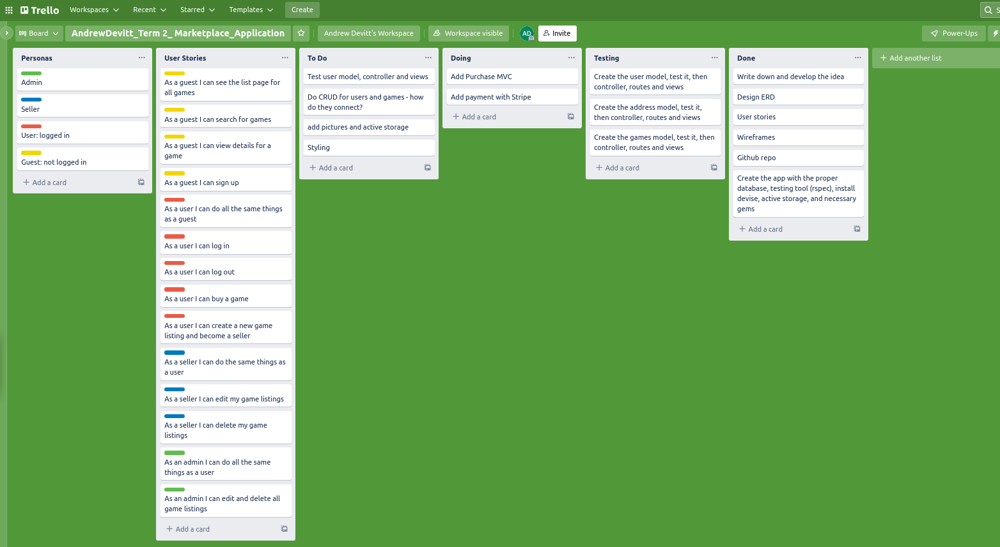
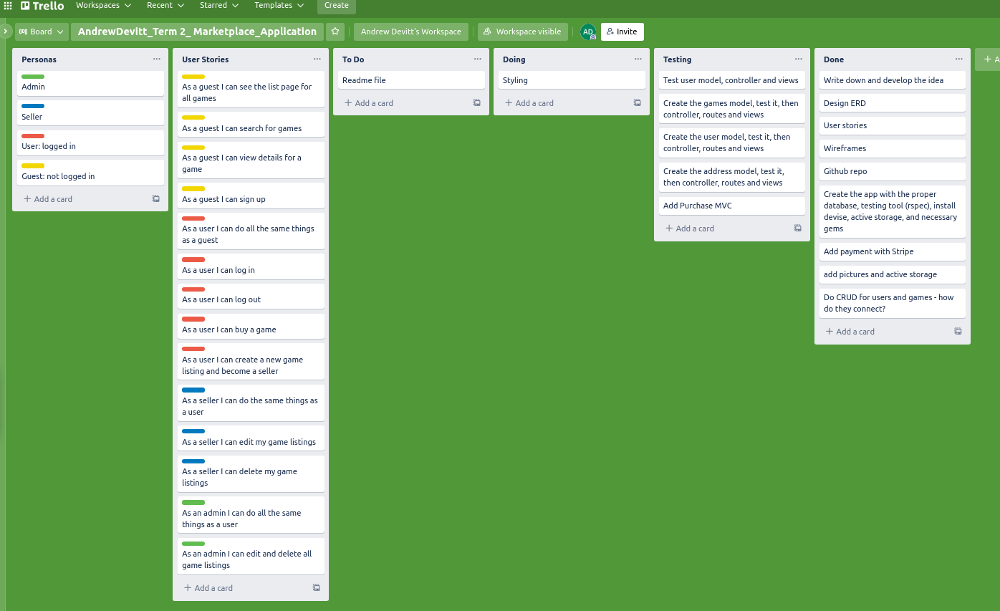

## Notes about the app use

* Ruby version - 2.7.5

* Node version - 16.14.0

* Database creation and initialization

    * PostgreSQL database
    Run:
        rails db:create
        rails db:migrate
        rails db:seed (if you want sample data)

    * Sample users
    
        * andy@test.com
        * saori@test.com
        * admin@test.com

        Password:foobar

